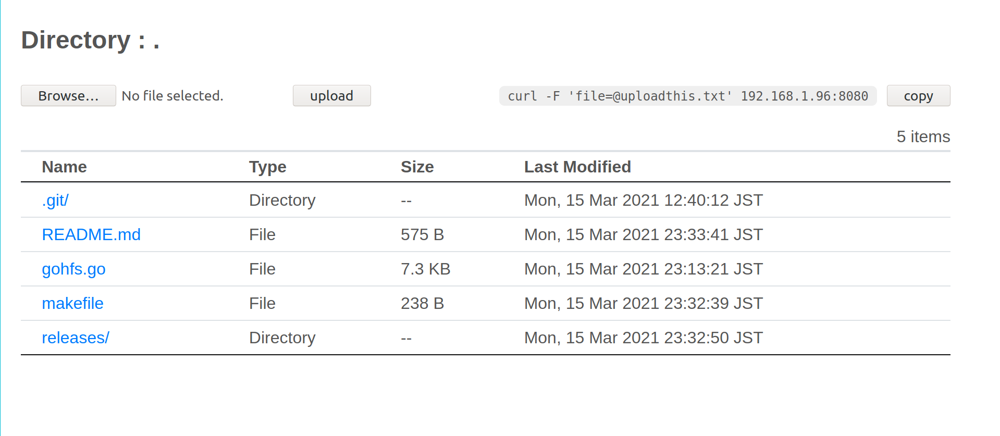

# GoHFS
Golang implementation of simple HTTP server with upload feature.  



This application is intended to replace python built-in module simple HTTP server.  
Therefore, there won't be any significant changes to the code.  
If you want to use more feature-rich application, I suggest [pwndrop](https://github.com/kgretzky/pwndrop).  
To get started with this app, simply download the binary in the `releases` folder.  
  

# Installation
```bash
wget -O gohfs https://github.com/finzzz/gohfs/raw/master/releases/gohfs-linux-amd64
chmod +x gohfs
```

# Getting started
```bash
# running in current directory
./gohfs

# specifying parameters
./gohfs -host 127.0.0.1 -port 8081 -dir /tmp

# getting help
./gohfs -h
```

# TODO
- [ ] disable directory listing option
- [ ] https support
- [ ] add authentication